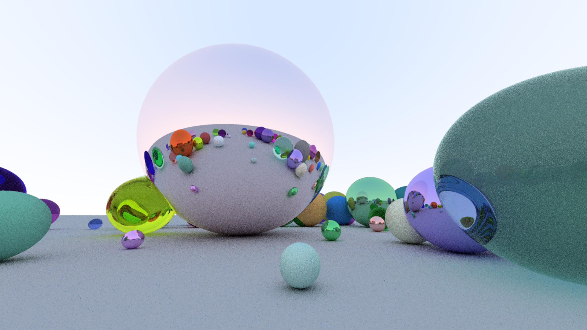
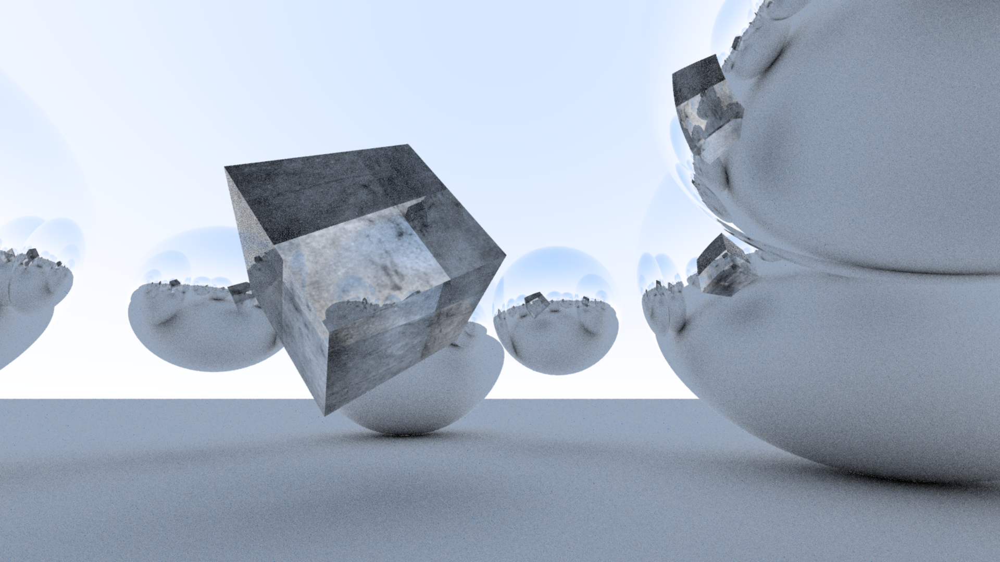

# Ray-Tracing-Demo
Real-time ray tracing demo with support for models and textures. Move around with mouse and WASD.

Reflective, refractive, and diffuse materials:

Imported .obj cube with texture and glass material:

Using OpenGL libraries.
